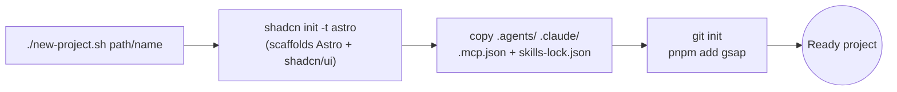

<div align="center">

# astro-shadcn-claude-starter

**A Claude Code starter for web projects.**
Astro + shadcn/ui + GSAP, with design skills and MCP servers preconfigured.

[](LICENSE)


<a href="#quick-start">Quick start</a> ·
<a href="#whats-included">What's included</a> ·
<a href="#how-it-works">How it works</a> ·
<a href="#customizing">Customizing</a>

</div>

---

## What is this?

A template repo, not a project. It holds the Claude Code setup I reuse on every web project — design skills, MCP servers, and project conventions — so a new site starts with all of it already in place instead of being rebuilt by hand.

One script scaffolds a fresh Astro + shadcn project anywhere on disk and drops that setup into it.

## Quick start

```bash
git clone https://github.com/OmarCaja/astro-shadcn-claude-starter.git
cd astro-shadcn-claude-starter
./new-project.sh ~/p/my-site
```

> Keep the template clone around and reuse it for every new project. Run `git pull` in it now and then to pick up skill updates.

The last path segment is the project name; missing parent folders are created for you. Relative paths work too (`../my-site`).

## How it works



Run `/init` inside the new project to generate its own `CLAUDE.md`.

## What's included

### MCP servers

| Server | Purpose |
| --- | --- |
| [`astro-docs`](https://mcp.docs.astro.build/mcp) | Up-to-date Astro documentation |
| [`shadcn`](https://ui.shadcn.com/docs/mcp) | Browse, search and install shadcn/ui components |

### Skills

| Skill | Source | Use for |
| --- | --- | --- |
| `impeccable` | [pbakaus/impeccable](https://github.com/pbakaus/impeccable) · [site](https://impeccable.style/) | Design, critique, polish and audit UI |
| `design-taste-frontend` | [Leonxlnx/taste-skill](https://github.com/Leonxlnx/taste-skill) · [site](https://www.tasteskill.dev/) | Landing pages that don't look templated |
| `web-design-guidelines` | [vercel-labs/agent-skills](https://github.com/vercel-labs/agent-skills) | Accessibility and UX review before shipping |
| `gsap-*` (8 skills) | [greensock/gsap-skills](https://github.com/greensock/gsap-skills) | Core, timeline, ScrollTrigger, plugins, utils, performance, React, frameworks |

Skills live in `.agents/skills/` and are symlinked into `.claude/skills/`. Versions are pinned in `skills-lock.json`.

## Repo layout

```
.
├── .agents/skills/      # skill sources
├── .claude/skills/      # symlinks Claude Code reads
├── .claude/settings.json  # shellcheck hook for new-project.sh (template only)
├── .mcp.json            # MCP servers
├── CLAUDE.md            # this repo's own conventions (not copied to new projects)
├── skills-lock.json     # pinned skill versions
└── new-project.sh       # scaffold script
```

## Requirements

[pnpm](https://pnpm.io), [Node.js](https://nodejs.org), `git`, `rsync`, and [Claude Code](https://claude.com/claude-code).

## Customizing

- **Fewer or different skills:** delete a skill's folder in `.agents/skills/` and its symlink in `.claude/skills/`, or add a new one the same way.
- **Different scaffold:** edit the `shadcn init` flags in [`new-project.sh`](new-project.sh).
- **Different stack notes:** edit [`CLAUDE.md`](CLAUDE.md) — it documents this template's own conventions; each generated project builds its own via `/init`.

## License

[MIT](LICENSE)
